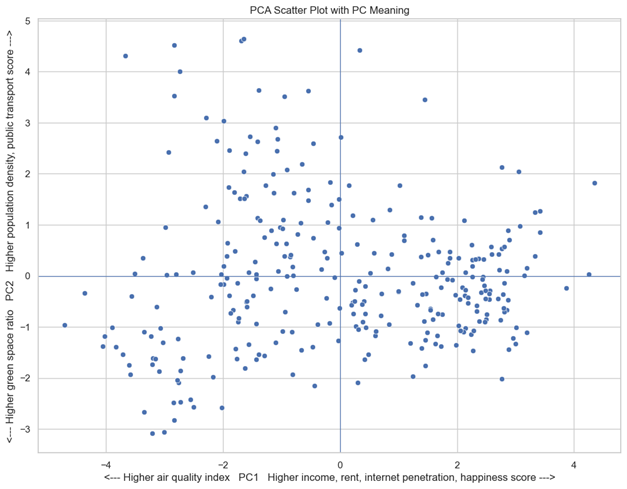
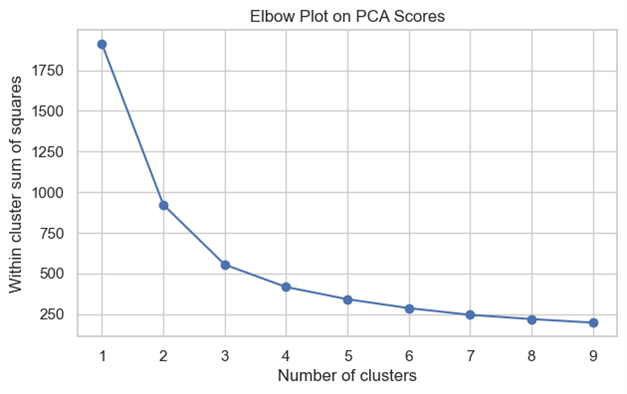
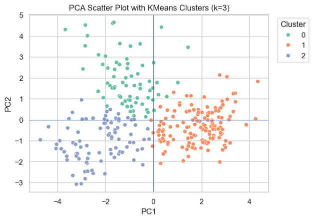

# PCA + NMF Unsupervised Analysis (City Lifestyle + Reviews)

## Overview
This project explores two unsupervised learning workflows:

1. **PCA (Principal Component Analysis)** on a city lifestyle dataset to reduce dimensions and interpret the main factors that differentiate cities.
2. **NMF (Non-negative Matrix Factorization)** topic modeling on a text review dataset using **TF-IDF** to extract common themes.

The notebook also includes **KMeans clustering on PCA scores** as an optional step to summarize group-level patterns in the 2D PCA embedding.

---

## Datasets
- **City Lifestyle Dataset:** `data/city_lifestyle_dataset.csv`  
  Includes numeric lifestyle indicators (e.g., income, rent, internet penetration, air quality, transport, density, green space) and location identifiers.

- **Reviews Dataset:** `data/reviews_data.csv`  
  Includes text reviews (used for TF-IDF + NMF topic modeling). Ratings contain some missing values but are not required for topic extraction.

---

## Methods

### Part A: PCA on City Lifestyle Data
Steps:
1. Drop non-numeric identifier columns (e.g., `city_name`, `country`) to keep only lifestyle measurements.
2. Standardize numeric features using **StandardScaler** (PCA is variance-driven).
3. Fit PCA with **2 components** for clear 2D visualization.
4. Interpret components using feature loadings.
5. (Optional) Apply **KMeans** on PCA scores and compare cluster means using original features.

Key PCA variance (from this analysis):
- **PC1:** 53.8%
- **PC2:** 25.8%
- **Total (PC1 + PC2):** 79.6%

---

### Part B: NMF Topic Modeling on Reviews
Steps:
1. Text preprocessing:
   - lowercasing
   - remove bracketed content
   - remove punctuation and special characters
   - stopword removal
   - lemmatization
2. Convert text into TF-IDF features using **TfidfVectorizer** (with `min_df` / `max_df` filtering).
3. Fit **NMF** with **5 topics**.
4. Interpret topics using top weighted keywords.

Data handling notes:
- Missing values appear only in the `Rating` column. Since topic modeling uses `Review` text, ratings are not required.
- Duplicate reviews were removed to avoid overweighting repeated text in TF-IDF and NMF.

---

## Results Summary

### PCA Insights
- **PC1** reflects a socio-economic and well-being axis (income, rent, internet penetration, happiness) contrasted with air quality index direction.
- **PC2** reflects an urban form axis (density and transport vs. green space).
- KMeans (k=3) on PCA scores provides an exploratory grouping that highlights different city profiles in the 2D space.

### NMF Insights
- The extracted topics reflect recurring themes such as:
  - in-store service and waiting time
  - payment and card/charge issues
  - general negative experiences and delays
  - positive product/staff feedback
  - drink quality and ordering/payment-related terms

---

## Visualizations

### PCA scatter with component meaning

### PCA scatter by region

### KMeans elbow plot (PCA scores)

### PCA scatter with KMeans clusters (k=3)

---

## Project Structure
